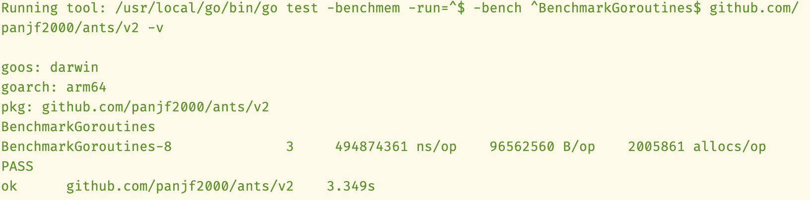
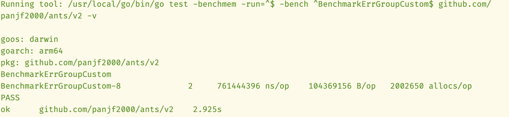
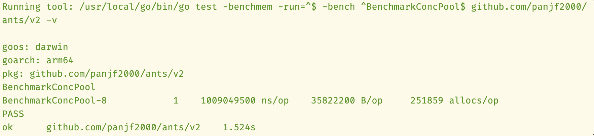
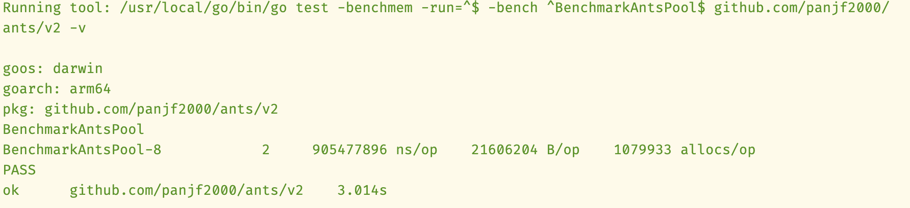
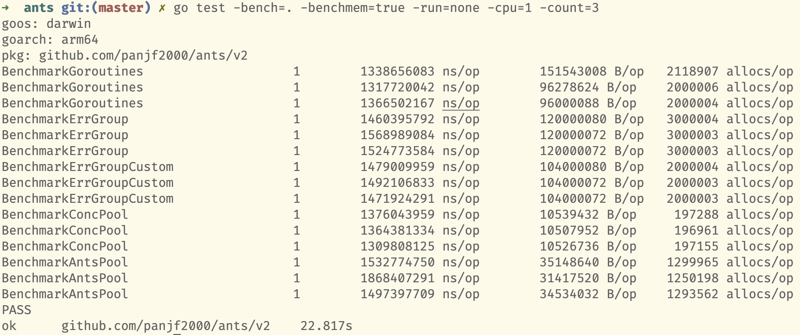

# Golang 协程池技术调研

# 仓库地址与社区

- `errgroup` 官方库 [golang.org/x/sync/errgroup](http://golang.org/x/sync/errgroup)
- `ants`  https://github.com/panjf2000/ants, 9.9k star
- `conc` https://github.com/sourcegraph/conc, 6k star

# 太长不看

- 使用协程池的目的：1）使并发程序代码更简洁；2）高并发情况下，节省内存占用
- 特性支持情况：

|  | 池中 worker 可复用 | 上下文 | WaitGroup 封装 | 错误处理 | 动态调整池容量 |
| --- | --- | --- | --- | --- | --- |
| errgroup | ❌ | ✅ | ✅ | ✅ | ❌ |
| conc | ✅ | ✅ | ✅ | ✅ | ❌ |
| ants | ✅ | ❌ | ❌ | ❌ | ✅ |
- `conc` 的功能最全面，基本可以涵盖覆盖各种场景，但因为使用泛型特性，需要 Go 1.19+
- `conc` 对 panic 的处理：`conc` 有一个 re-panic 的机制，它会先捕获 task 中产生的 panic，等待资源回收完毕，最后 `Wait()` 再重新产生 panic。因此，可以按需在 `Wait()` 的调用处自行 recover
- 不考虑风格偏好，从使用简便性来看，`errgroup` 和 `conc` 都相当出色，`ants` 则比较逊色
- conc 的内存优化最佳，ants 其次（见后文性能测试）

# 源码分析

- `ants` 维护一个 worker 队列，每一个 worker 有一个任务 channel
- `conc` 维护一个自己的 worker 队列，整个协程池只有一个任务 channel
- 相对的，用户每次传入一个任务，`errgroup` 都会创建一个新的协程

关于 channel 的缓冲区大小

- `ants` 在创建 worker 的同时创建新 channel，若 GOMAXPROCS=1，则采用同步通信（buffer=0），若 GOMAXPROCS>1，则采用异步通信（buffer=1），据说性能更优（详情参见注释）
- `conc` 采用同步通信（buffer=0）

# 使用演示代码

场景设例：计算目录下文件的 MD5 值。

[demo code](goroutine-pool/demo.go)

# 性能测试数据

Apple M1 八核
    

Apple M1 单核

    
[测试代码](goroutine-pool/ants_benchmark_test.go)（基于 ants_benchmark_test.go 修改）
    
# 性能数据分析

M1 八核

- 计算性能按排名，纯原生约为 0.5 s/op，errgroup 与 ants 的计算性能均为 0.8-0.9 s/op，conc 约为 1.1 s/op
- 内存占用按排名，conc 约为 6 MB/op，ants 约为 17 MB/op，纯原生约为 96 MB/op，errgroup 约为 104 MB/op

M1 单核

- 计算性能按排名，纯原生和 conc 均为 1.3 s/op，errgroup 1.4 s/op，ants 1.5 s/op，整体差异小
- 内存占用按排名，conc 10 MB/op，ants 32 MB/op，errgroup 104 MB/op，纯原生 96-120 MB/op 波动

AMD 虚拟机双核

- 计算性能按排名，ants 约为 2 s/op，纯原生约为 2.1 s/op，errgroup 约为 2.2 s/op，conc 约为 2.5 s/op
- 内存占用按排名，conc 10 MB/op，ants 22 MB/op，errgroup 104 MB/op，纯原生 96-120 MB/op 波动

AMD 虚拟机单核

- 计算性能按排名，纯原生 3.4 s/op，errgroup 3.6 s/op，conc 3.9 s/op，ants 4.6 s/op
- 内存占用按排名，conc 10 MB/op，ants 32 MB/op，errgroup 104 MB/op，纯原生 96-120 MB/op 波动

# 性能分析总结

纯原生 goroutine 的计算性能已经无可比拟，协程库的优势主要体现在内存占用上，尤其是 conc 表现最佳，比纯原生实现内存占用少 10 倍。