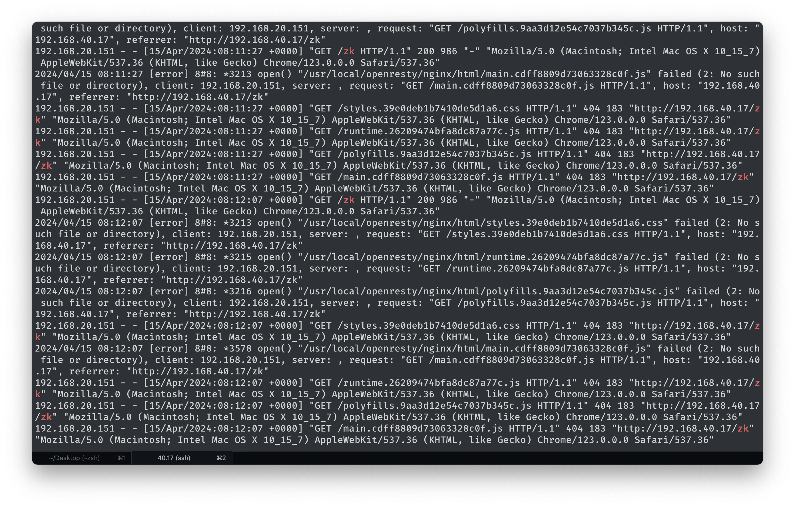

# Nginx 网关转发配置

## Q

尝试配置 /zk 转发到 9000 ZooKeeper 服务，下面的网关报错是什么意思？



## A

```
request: "GET /styles.39e0deb1b7410de5d1a6.css HTTP/1.1", host: "192.168.40.17", referrer: "http://192.168.40.17/zk"
```

这个 referer 表示请求发起者，也就是说这个请求是 /zk 页面、也就是 ZooKeeper 前端发起的。可见网关配置没有覆盖全面。那如何编写网关配置呢？

解决方案：主流的带前端页面的服务都支持配置 url 前缀，比如 prometheus 的启动参数 `--web.external-url`，grafana 的环境变量 `GF_SERVER_ROOT_URL` 等。
