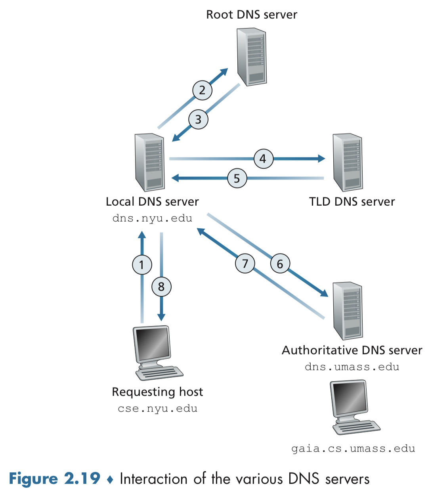
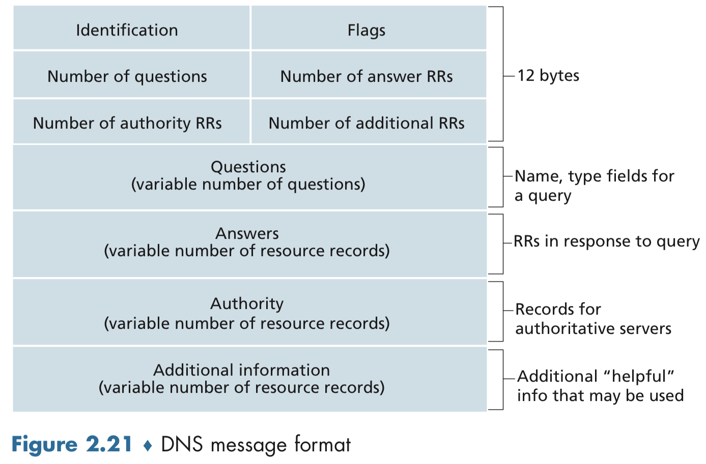

# DNS 解析原理

## DNS 使用什么端口

UDP 53。为什么使用 UDP 而不是 TCP：

1. UDP 更快，不需要 3 次握手
2. DNS 请求的数据量很小，适合放到 UDP 数据报里发送
3. 尽管 UDP 本身不可靠，但我们可以在应用层为其实现可靠性，比如超时处理

## DNS 服务器类型

DNS server hierarchy（DNS 服务器可以按照层级被分为 3 类）：

1. 根服务器，它们提供 TLD 服务器的 IP 地址，全球共有 1000 多个根服务器的实例，它们都是 13 个根服务器的拷贝，这些服务器由 12 家组织管理，而这些组织又由 IANA 官方协调。

2. 顶级域名（TLD，top level domain）服务器，它们提供官方服务器的 IP 地址。每个顶级域名都有专门的 TLD 服务器，比如 com 域名的 TLD 服务器是由 Verisign Global Registry Services 公司管理，edu 域名则由 Educause 公司管理。

3. 官方服务器 Authoritative servers，它知道你想访问的域名的 IP 地址。许多大学和公司有维护自己的官方服务器。

实际上，除了上面提及的这 3 种，每个 ISP 还有自己的本地 DNS 服务器（LDNS），它们代理到 DNS server hierarchy 的请求。

## DNS 请求的完整过程

### 没有缓存的情况

从上图我们可以知道，为了获得一个域名对应的 IP 地址，至少要进行 4 次 DNS 请求。实际上还会比这更多，因为还有许多中继 DNS 服务器没有画出来。

1. 客户端请求本地 DNS 服务器
2. 本地 DNS 服务器请求 root 服务器，获取 TLD（Top Level Domain）服务器地址，每个 TLD 服务器管理一个特定的顶级域名，比如 .com
3. 本地 DNS 服务器请求 TLD 服务器，获取 authoritative 服务器地址，它知道 IP
4. 本地 DNS 服务器请求 authoritative 服务器，获取解析结果

### 有缓存的情况

为了降低网络延迟，减少 DNS 请求的发送，我们可以通过 DNS 缓存技术来应对。很简单，就是在 DNS 服务器上缓存匹配结果。通常来说，缓存会在两天之后清除。事实上，由于多数本地 DNS 服务器都缓存了 TLD 服务器的 IP 地址，除了极少部分的 DNS 查询之外，根服务器通常会被绕过。

当 Alice 访问 www.amazon.com 时，Alice 的客户端首先向本地 DNS 服务器发起一个请求，本地 DNS 服务器尝试联络顶级域名（TLD）com 服务器。如果本地 DNS 服务器没有缓存这个 TLD 的地址，则需要先访问根服务器获取 TLD 的 IP 地址。

TLD 服务器上有对应的官方服务器信息的 NS 类型和 A 类型的两个资源记录（resource records, RR），TLD 服务器把这两条 RR 回复给本地服务器。

本地服务器再向官方服务器的 IP 地址发送 DNS 请求，获得关于域名 www.amazon.com 的 A 类型的 RR，本地服务器最终把得到的 IP 地址发回给 Alice。

终于获得 IP 地址后，Alice 的浏览器开始建立 TCP 连接，随后通过连接发送 HTTP(S) 请求。

## DNS 使用什么数据类型

DNS 服务器存储资源记录（resource records, RR）元组，每条 RR 反应一条映射关系。每个 DNS 回复都包含一至多个 RR。RR 是一个像下面这样的元组：

`(Name, Value, Type, TTL）`

`TTL` 是 DNS 消息在缓存中存留的时间，我们先忽略它。`Name` 和 `Value` 的含义由 `Type` 决定。

1. 当 `Type=A`，表示这条 RR 记录了 主机名-IP 地址 映射关系，比如： `(relay1.bar.foo.com, 145.37.93.126, A)`
2. 当 `Type=NS`，表示这条 RR 记录了某一个域名和（知道如何获取该域名 IP 地址的）官方服务器的主机名，比如： `(foo.com, dns.foo.com, NS)`
3. 当 `Type=CNAME`，表示这条 RR 记录了 主机别名（alias hostname）-规范主机名（canonical hostname） 映射关系，比如： `(foo.com, relay1.bar.foo.com, CNAME)`，实际发起查询的时候应该用的是规范主机名
4. 当 `Type=MX`，表示这条 RR 记录了邮件服务器的主机别名和规范主机名的映射关系（略）

举个例子，假如某个 edu 的顶级域名（TLD）服务器不是 gaia.cs.umass.edu 的官方服务器，那么这个 TLD 服务器上会有这样两条 RR 记录：

1. `(mass.edu, dns.umass.edu, NS)`，表示要找到 mass.edu 的地址，需要访问 dns.umass.edu 这个官方服务器
2. `(dns.umass.edu, 128.119.40.111, A)`，记录 dns.umass.edu 这个官方服务器的 IP 地址

而在官方服务器上，则只会包含一条 A 类型的记录。

## DNS 请求的结构

DNS 是应用层协议，所有的 DNS 请求都是通过 UDP 数据报发送到端口 53。DNS 请求和回应的消息格式是一样的。

通过 nslookup 这个程序，可以向 DNS 服务器发起 DNS 请求，并接收到一个 human readable 的 DNS 回应。而且可以直接向权威服务器发起查询。

还有如何从 DNS 数据库中取记录，以及如何插入记录等问题，省略。

## DNS 攻击是怎么回事

DNS 是互联网基础设施中的重要部分，所以我们很自然的发问，DNS 服务器会怎么如何攻击？一旦受到攻击，会不会导致大部分的互联网应用无法使用？

第一种攻击方式是针对 DNS 根服务器的 DDoS 攻击。2002 年 10 月 21 日就出现过一次针对 13 个 DNS 根服务器的 DDoS 攻击，不过没有造成多大影响，因为攻击发起的是 ICMP ping 消息，而大部分根服务器都过滤了 ICMP 包。

针对 TLD 服务器的攻击会更有效，因为它不像根服务器那么容易被绕过。2016 年 10 月 21 日就出现了一次针对 TLD 服务器的攻击，这是上百万台被 Mirai malware 感染的僵尸网络中的物联网设备发起的 DDoS 攻击，它紊乱了 Amazon，Twitter，Netflix，Github 和 Spotify 等服务差不多一整天。

还有其他攻击方式。通过中间人攻击，可以给主机返回伪造的 DNS 回应；通过 DNS 投毒攻击，攻击者可以给 DNS 服务器发送伪造的 DNS 回应，让它把错误的记录添加到缓存中。