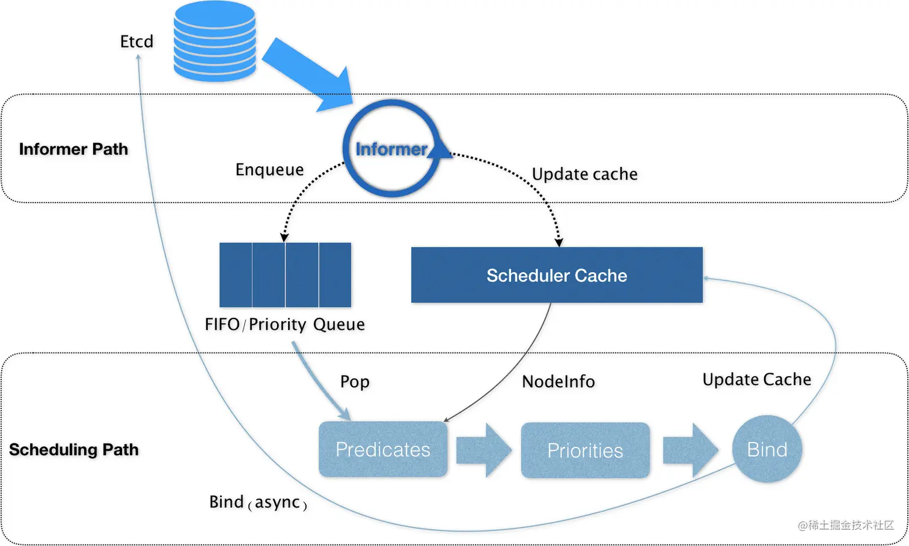

# kube-scheduler

Q:

- 说明一个 Pod 是如何完成调度的？
- 调度器是怎样做性能优化的？

两个调度算法：

1. Predicate，计算符合 Pod 调度条件的节点
2. Priority，对可调度的节点打分

两个数据结构：

1. 调度器缓存 scheduler cache: 包括调度算法需要用到的节点和 Pod 的信息
2. 调度队列：存储待调度 Pod 的优先级队列

两个控制循环：

1. 通知路径 Informer Path: 监听 etcd 中 Pod 等 API 对象的变化，将待调度的 Pod 添加到调度队列
2. 调度路径 Scheduling Path: 从调度队列中出队一个 Pod，并从调度器缓存获取节点信息，用 Predicate 算法经过一遍过滤得到可以运行该 Pod 的节点列表，再用 Priority 算法对节点打分，并将 Pod 乐观绑定到得分最高的节点

调度器性能优化三大核心：

1. 缓存化：调度器缓存用于将集群信息缓存化
2. 乐观绑定：绑定就是设置节点的 `nodeName`，绑定其实分成两步：1）Assume，调度路径的最后只假设调度完成，更新调度器缓存中的 Pod 和 Node 信息，不会阻塞，同时调度器会创建一个 goroutine 来异步地向 API Server 发起更新 Pod 的请求，来完成真正的绑定操作，最后更新到 etcd；2）Admit，kubelet 二次确认该 Pod 能否在该节点运行。如果 Admit 操作中绑定失败了也没关系，等调度器缓存（在通知路径中）同步过来即可
3. 无锁化：调度器会启动多个 gorutine 以节点为粒度并发执行 Predicate 算法，用 MapReduce 并行计算然后汇总；Priority 算法也是一样。调度器会避免设置任何全局的竞争资源，免除了使用锁同步产生的巨大性能损耗。整个调度器只有在对调度队列和调度器缓存进行操作时才需要加锁，而这两个操作都不在调度路径上

